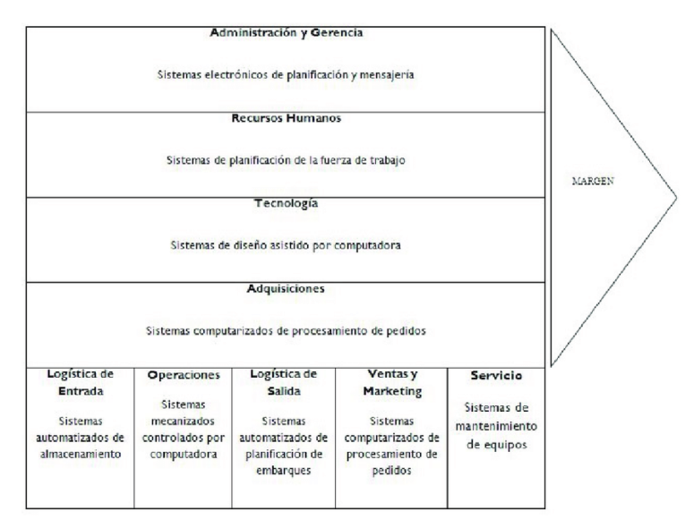
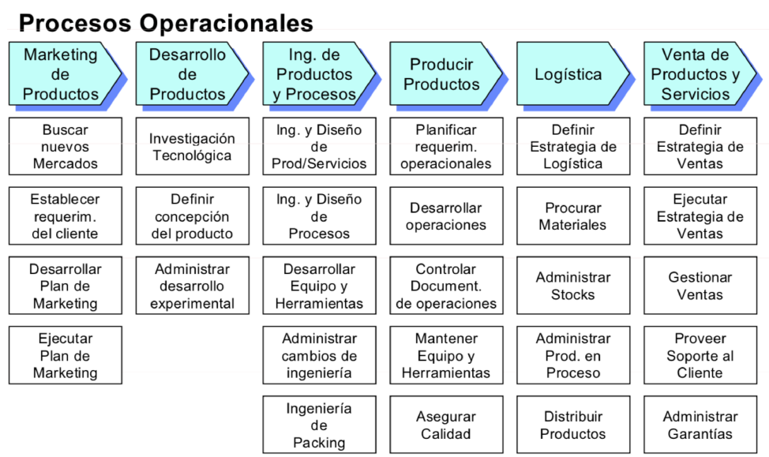
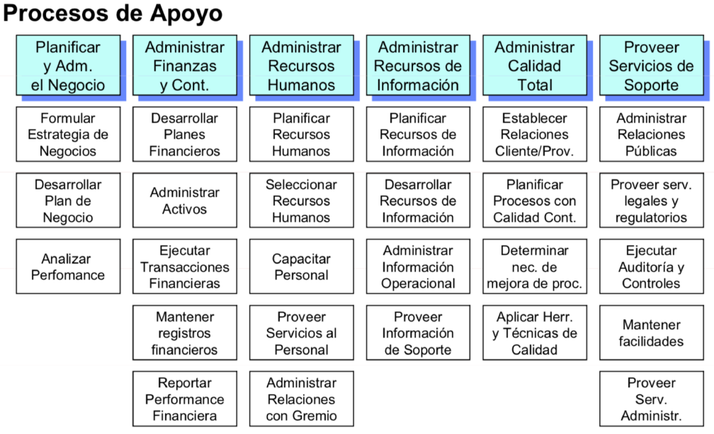

# 1. SGE - Software de Gestión Empresas

- [1. SGE - Software de Gestión Empresas](#1-sge---software-de-gestión-empresas)
  - [1.1. Sistema de Información](#11-sistema-de-información)
    - [1.1.1. ¿Qué funciones cumplen?](#111-qué-funciones-cumplen)
    - [1.1.2. ¿Cuales son los objetivos?](#112-cuales-son-los-objetivos)
    - [1.1.3. Evolucion de los sistemas de información](#113-evolucion-de-los-sistemas-de-información)
    - [1.1.4. Clasificación de los sistemas de información](#114-clasificación-de-los-sistemas-de-información)
    - [1.1.5. Componentes de un sistema de información](#115-componentes-de-un-sistema-de-información)
    - [1.1.6. Pirámide informacional](#116-pirámide-informacional)
    - [1.1.7. Etapas de desarrollo de un sistema de información](#117-etapas-de-desarrollo-de-un-sistema-de-información)
    - [1.1.8. Enfoque de desarrollo](#118-enfoque-de-desarrollo)
    - [1.1.9. Éxito y fracaso de los sistemas de información](#119-éxito-y-fracaso-de-los-sistemas-de-información)
  - [1.2. Los sistemas de información de las organizaciones](#12-los-sistemas-de-información-de-las-organizaciones)
    - [1.2.1. Introducción](#121-introducción)
    - [1.2.2. Procesos de negocio](#122-procesos-de-negocio)
    - [1.2.3. Estructura](#123-estructura)
    - [1.2.4. La organización](#124-la-organización)
    - [1.2.5. Fuerzas y estrategias competitivas](#125-fuerzas-y-estrategias-competitivas)
    - [1.2.6. Estrategias](#126-estrategias)
    - [1.2.7. Cadena de valor de Porter](#127-cadena-de-valor-de-porter)
    - [1.2.8. Informatica en la organización](#128-informatica-en-la-organización)
    - [1.2.9. Ventajas competitivas](#129-ventajas-competitivas)
    - [1.2.10. La organización y los sistemas de información](#1210-la-organización-y-los-sistemas-de-información)
    - [1.2.11. Diseño de la organización](#1211-diseño-de-la-organización)
    - [1.2.12. Areas funcionales](#1212-areas-funcionales)
    - [1.2.13. Sistemas de información para cada nivel](#1213-sistemas-de-información-para-cada-nivel)
    - [1.2.14. Sistemas de información integrales](#1214-sistemas-de-información-integrales)
  - [1.3. ERP - Soluciones integradas para la planificación de recursos](#13-erp---soluciones-integradas-para-la-planificación-de-recursos)
    - [1.3.1. Evolucion Historica](#131-evolucion-historica)
    - [1.3.2. Definición de ERP](#132-definición-de-erp)
    - [1.3.3. Objetivos de un ERP](#133-objetivos-de-un-erp)
    - [1.3.4. Mercado de ERP](#134-mercado-de-erp)
    - [1.3.5. Por que implantar un ERP](#135-por-que-implantar-un-erp)
    - [1.3.6. Ventajas de un ERP](#136-ventajas-de-un-erp)
    - [1.3.7. Inconvenientes de un ERP](#137-inconvenientes-de-un-erp)
    - [1.3.8. Ventajas por departamentos](#138-ventajas-por-departamentos)
    - [1.3.9. Características de un ERP](#139-características-de-un-erp)
    - [1.3.10. Ciclo de vida](#1310-ciclo-de-vida)
    - [1.3.11. Modulos](#1311-modulos)
    - [1.3.12. Como elegir un ERP](#1312-como-elegir-un-erp)
    - [1.3.14. ¿Por que fracasan los ERP?](#1314-por-que-fracasan-los-erp)
  - [1.4. CRM - Gestión de la relaciones con los clientes](#14-crm---gestión-de-la-relaciones-con-los-clientes)
    - [1.4.1. ¿Qué es la gestión de la relación con los clientes?](#141-qué-es-la-gestión-de-la-relación-con-los-clientes)
    - [1.4.2. Mercado de CRM](#142-mercado-de-crm)
    - [1.4.3. Definición de CRM](#143-definición-de-crm)
    - [1.4.4. Evolución del CRM](#144-evolución-del-crm)
    - [1.4.5. Funcionalidades de un CRM](#145-funcionalidades-de-un-crm)
    - [1.4.6. Partes de un CRM](#146-partes-de-un-crm)
    - [1.4.7. Criterios de selección de un CRM](#147-criterios-de-selección-de-un-crm)
    - [1.4.8. Implantación de un CRM](#148-implantación-de-un-crm)
    - [1.4.9. Relación entre CRM y ERP](#149-relación-entre-crm-y-erp)
    - [1.4.10. Beneficios de un CRM](#1410-beneficios-de-un-crm)
  - [1.5. SCM - Gestión de la cadena de suministro](#15-scm---gestión-de-la-cadena-de-suministro)
    - [1.5.1. ¿Qué es la gestión de la cadena de suministro?](#151-qué-es-la-gestión-de-la-cadena-de-suministro)
    - [1.5.2. Evolucón de la gestión de la cadena de suministro](#152-evolucón-de-la-gestión-de-la-cadena-de-suministro)
    - [1.5.3. Flujo de información](#153-flujo-de-información)
    - [1.5.4. Tipos de Software SCM](#154-tipos-de-software-scm)
    - [1.5.5. Mercado de SCM](#155-mercado-de-scm)
    - [1.5.6. SCM en la empresa](#156-scm-en-la-empresa)
    - [1.5.7. Modulos de un SCM](#157-modulos-de-un-scm)
    - [1.5.7. Industria 4.0, Cloud, IoT, Big Data y otras tecnologías relacionadas con la SCM](#157-industria-40-cloud-iot-big-data-y-otras-tecnologías-relacionadas-con-la-scm)
  - [1.6. HCM - Gestión de recursos humanos](#16-hcm---gestión-de-recursos-humanos)
    - [1.6.1. ¿Qué es la gestión de recursos humanos?](#161-qué-es-la-gestión-de-recursos-humanos)
    - [1.6.2. Funciones de la gestión de recursos humanos](#162-funciones-de-la-gestión-de-recursos-humanos)
    - [1.6.3. Gestión de recursos humanos en la empresa](#163-gestión-de-recursos-humanos-en-la-empresa)
    - [1.6.4. Herramientas de gestión de recursos humanos](#164-herramientas-de-gestión-de-recursos-humanos)
    - [1.6.5. Componentes basicos](#165-componentes-basicos)
    - [1.6.6. Planificación de los recursos humanos](#166-planificación-de-los-recursos-humanos)
    - [1.6.7. Beneficios de los recursos humanos](#167-beneficios-de-los-recursos-humanos)
  - [1.7. e-Commerce](#17-e-commerce)
    - [1.7.1. ¿Qué es el e-Commerce?](#171-qué-es-el-e-commerce)
    - [1.7.2. Características del e-Commerce](#172-características-del-e-commerce)
    - [1.7.3. Evolución del e-Commerce](#173-evolución-del-e-commerce)
    - [1.7.4. Herramientas comerciales](#174-herramientas-comerciales)
    - [1.7.5. Tipos de e-Commerce](#175-tipos-de-e-commerce)
    - [1.7.6. Mobile Commerce](#176-mobile-commerce)
    - [1.7.7. Mecanismos de e-Commerce](#177-mecanismos-de-e-commerce)
  - [1.8. Business Intelligence](#18-business-intelligence)
    - [1.8.1. ¿Qué es Business Intelligence?](#181-qué-es-business-intelligence)
    - [1.8.2. Componentes de un Business Intelligence](#182-componentes-de-un-business-intelligence)
    - [1.8.3. Capacidades Analíticas de un Business Intelligence](#183-capacidades-analíticas-de-un-business-intelligence)
    - [1.8.4. Implementación de un Business Intelligence](#184-implementación-de-un-business-intelligence)
    - [1.8.5. Definición de los orígenes de datos](#185-definición-de-los-orígenes-de-datos)
    - [1.8.6. Extracción y organización de los datos](#186-extracción-y-organización-de-los-datos)
    - [1.8.7. Aplicación de herramientas analíticas](#187-aplicación-de-herramientas-analíticas)

## 1.1. Sistema de Información

### 1.1.1. ¿Qué funciones cumplen?

- `Dan soporte` a las operaciones de la empresa
- Proporcionan informacion mediante `tecnologias de la información`
- `Elemento estratégico` en busca de innovación y ventaja competitiva
- `Integran` personas, procesos, datos y tecnologías.
  - No solo en la organización, tambien proveedores, distribuidores y clientes
- `Comprender` los procesos operativos
- `Familiarizarse` con las herramientas para construir y gestionar sistemas de información
  - Toma de decisiones
  - Gestión del conocimiento
  - Gestión de procesos internos
  - Relaciones con los clientes
  - Cadena de suministros
  - Comercio electrónico
  - Inteligencia de negocios
- `Puente`entre la gestión y la tecnología
  - Analizar requisitos de la organización
  - Diseñar la solución
  - Integrar las herramientas mas adecuadas
- Identificar
  - Oportunidades de mejora
  - Innovación
  - Competir estratégicamente

### 1.1.2. ¿Cuales son los objetivos?

- Amenaza de nuevos participantes
  - Mejorar control de los canales de distribución y aprovisionamiento
  - Adecuar mejor los productos a las necesidades de los clientes
  - Explotar economías de escala
  - Competir en guerra de precios
- Amenaza de productos o servicios sustitutivos
  - Adaptación a las necesidades de los clientes
  - Identificar mas fácilmente las necesidades de los clientes
- Rivalidad con los competidores actuales:
  - Permiten reducir costes
  - Mejorar la imagen de marca
- Poder negociador de clientes y proveedores
  - Equilibrar el poder de negociación de los clientes y proveedores

### 1.1.3. Evolucion de los sistemas de información

- Introducción de la informática en la organización
  - Buscan simplificar y automatizar los procesos administrativos
  - Ahorro de costes y tiempo de la realización
  - Carencia de formación del personal en informática
- Etapa de contagio de las aplicaciones informáticas
  - Mejoras difundiendo por los diferentes departamentos
  - Contagio sin ninguna planificación que produce incremento de los costes
  - Aumenta la formacón del personal en informática
- Coordinación de los sistemas de información y los objetivos de la empresa
  - Se utilizan en la totalidad de la organización como elemento fundamental
  - Se elaboran los procedimientos de planificación de los sistemas de información
- Aparición de los sistemas de infromación estratégicos
  - Se convierten en ventaja competitiva
  - Se tienen en cuenta al elaborar la estrategia como otros aspetos clave de la empresa
  - El responsable de los sistemas de información se convierte en un miembro mas del comité de dirección

### 1.1.4. Clasificación de los sistemas de información

- Formalidad
  - Formales
  - Informales
- Automatización
  - Manuales
  - Automáticos
- Toma de decisiones
  - Estratégicos
  - Gerenciales
  - Operativos
- Funcionalidad
  - Gestión comercial
  - Gestión contable
  - Gestion financiera
  - Gestion de RRHH
  - Gestion de la produccion
- Especialización
  - Especificos
  - Generales

### 1.1.5. Componentes de un sistema de información

- Equipamiento
  - HW
  - SW
  - Tecnologías de almacenamiento
  - Tecnologías de comunicación
- Usuarios
  - Personal directivo
  - Empleados
  - Clientes
  - Proveedores
- Procesos
  - Compras
  - Facturación de ventas o servicios
  - Gestión de personal
  - ...
- Datos
  - Datos generales de cliente
  - Tickets de venta
  - Albaranes de compra
  - ...

### 1.1.6. Pirámide informacional

### 1.1.7. Etapas de desarrollo de un sistema de información

1. Definición del proyecto
   - Encontrar problemas y soluciones
   - Identificar objetivos y ubicarlos en la estrategia global
   - Comprender y confiar en los sistemas de información como armas estratégicas
2. Análisis de sistemas
   - Realizar estudio de factibilidad
      - Tecnico - ¿Se tienen los medios?
      - Económico - ¿Se tiene el dinero?
      - Operativo - ¿Es posible con la organización y personal actual?
3. Diseño de Sistemas
   - Detallar los requisitos planteados en la fase de análisis
   - Indicar componentes tanto HW como SW y su relacion
   - Realizar las especificaciones técnicas del sistema
4. Programacón
   - Traducir las especificaciones técnicas en un lenguaje de programación
5. Fase de pruebas
   - Proceso exhaustivo y profundo en diversas condiciones para comprobar que los resultados son correctos.
     - Pruebas de programas - Comprobar que el programa funciona correctamente
     - Pruebas de sistemas - Comprobar que el sistema en conjunto funciona correctamente
     - Pruebas de aceptación - Comprobar que los usuarios finales estan satisfechos
6. Migración
   - Si ya existia un sistema se debe migrar la información
     - Estrategia en paralelo - Se ejecutan los dos sistemas a la vez durante un periodo de tiempo
     - Camio directo - Se cambia de un sistema a otro de forma directa
     - Experiencia piloto - Se prueba el sistema en un departamento y si funciona se extiende a toda la organización
7. Producción y mantenimiento
   - Proceso constante de evaluación y mejora medainte la corrección de errores y la adaptación a las necesidades de la organización

### 1.1.8. Enfoque de desarrollo

- Ciclo de vida clásico en cascada
- Prototipos
- Metodologías ágiles
  - Scrum
  - Kanban
  - XP

### 1.1.9. Éxito y fracaso de los sistemas de información

- Falta de alineación entre los sistemas de información y la estrategia de la empresa
  - Considerar los sistemas de información como una simple herramienta y no valorar su importancia estratégica
- Escaso apoyo de la administracion:
  - No se percibe como arma estratégica
  - Predisposicion a cambiar la organización empresarial
- Mala identificación de las necesidades de información
- Escassa involucración o influencia del usuario final
  - Es necesaria la colaboración del usuario final
- Nula formación del personal

## 1.2. Los sistemas de información de las organizaciones

### 1.2.1. Introducción

- Los SI buscan mejorar la empresa formando parte de la estructura de la misma.

### 1.2.2. Procesos de negocio

- Reglas, procedimientos y prácticas que se han desarrollado para enfrentar prácticamente cualqueir situación que surja.
- Rutinas de producción
- La empresa en si es un cojunto de procesos
- Asociados a areas funcionales
- Pueden ser transversales

### 1.2.3. Estructura

- La estructura de la organizacion se refleja en los sistemas de información
- Niveles de decisión
  - Alta dirección
  - Gerentes intermedios
  - Gerentes de operaciones
  - Personal de operaciones
- Clasificación de Mintzberg
  - Empresario o emprendedor
    - Muy variado
    - Unico administrador
    - Empresa pequeña
  - Burocracia mecánica
    - Entornos lentos
    - Equipos centralizados
    - Empresa de manufactura media
  - Burocracia con divisiones
    - Combinación de burocracias
    - Oficinas centrales
    - Gran empresa
  - Burocracia profesional
    - Basado en el conocimiento y la experiencia
    - Departamentos centralizados debiles
    - Bufetes, escuelas, hospitales

### 1.2.4. La organización

- Esfuerzo conjunto
- Es necesario un objetivo
  - Beneficios
  - Condiciones de trabajo
  - Sociedad
- Es necesaria la rentabilidad
  - Mejorar eficacia
    - Tener unos grados de cumplimiento
    - Usar sistemas que permitan un control de la información de los procesos
    - Sistemas que faciliten la propia realización de los procesos
    - Ejemplos:
      - Procesadores de texto
      - Videoconferencias
      - Tablets
      - Hojas de cálculo
      - Correos electrónicos
  - Mejorar eficiencia
    - Busca cumplir los objetivos con el menor coste posible
    - Permiten ahorrar costos
    - Reducir los labores manuales
    - Reducir el espacio fisico
    - Ejemplos:
      - Procesadores de texto
      - Videoconferencias
      - Tablets
      - Hojas de cálculo
      - Correos electrónicos
      - Sistemas de control de la producción
      - Pasarelas de pago
      - Tramites online
  - Obtener ventaja competitiva
    - Diferenciarse de la competencia
    - Obtener resultados superiores
    - No son herramientas
    - Ejemplos:
      - Mejoras en los procesos
      - Ofrecen oportunidades de negocio
      - Transforman el sector

### 1.2.5. Fuerzas y estrategias competitivas

- Fuerzas competitivas de Porter
  - Permite analizar cualqueir industria en términos de rentabilidad y definir una estrategia competitiva
  - Ofrece un panorama general de la empresa
  - Cinco fuerzas
    - Rivalidad entre competidores
      - Formas nuevas y eficientes de producir
      - Nuevos servicios y productos
      - Estrategias de fidelización
    - Amenaza de nuevos participantes
    - Productos y servicios sustitutos
      - Casi todos los productos y servicios tienen sustitutos
      - La nuevas tecnologías crean sustitutos constantemente
      - Esto significa menos control del precio y menor margen de beneficio
    - Poder de negociación de los clientes
      - La rentabilidad depende de atraer y mantener clientes con precios altos
      - Esto permite poder cambiar los productos y servicios y poder de negociación
      - Mercados mas trasparentes y poco diferenciados
    - Poder de negociación de los proveedores
      - Depender de un proveedor puede ser peligroso
      - Menos proveedores significa menos poder de negociación, materias mas caras y menos rentabilidad
      - Diversificar para evitarlos

### 1.2.6. Estrategias

- Liderazgo de costes bajos
  - Ofrecer productos o servicios a un precio mas bajo que la competencia
  - Mantener la calidad
  - Encontrar forma de reducir costes
  - Incrementar los costes de los competidores
    - Patentes
    - I+D
    - Certificaciones
  - Usar SI
  - Sistemas de respuestas eficientes a clientes
  - Ofrecer facilidades a los clientes y proveedores
  - Digitalizar
- Diferenciación
  - Crear productos o servicios únicos
  - Reducir las ventajas de los competidores
  - Especializarse en nichos de mercado
    - Especializarse
    - Usar los datos para utilizarlos en ventas y marketing
    - Analizar patrones de compra
    - Administrar las relaciones con los clientes
  - La ventaja acaba si otros te copian y superan
  - Ofrecer comodidad al clientes
  - Personalizar los productos y servicios
- Innovación
  - Cambios draticos en los procesos
  - Hallar nuevas formas de hacer negocios
    - Streaming
  - Mejorar realemente los productos o servicios
- Crecimiento
  - Amplicar la capacidad para producir
  - Extender a mercados globales
  - Diversificar los productos y servicios
  - Generar nuevos productos y servicios
- Alianzas
  - Establecer vincluos y alianzas de negocios

### 1.2.7. Cadena de valor de Porter

- Actividades especificas y criticas por las que empezar

### 1.2.8. Informatica en la organización

- Transforman las relaciones tanto dentro como fuera de la empresa
- Modifican las relaciones entre departamentos
- Modifica los procesos para hacerlos mas eficientes y rentables
- Se generan nuevos procesos y relaciones

### 1.2.9. Ventajas competitivas

- Infraestructura de la empresa
  - Correo electrónico
  - Tablones de anuncios
  - Manuales de empresa
  - Directorios y agendas
  - Normativa interna
  - Procesos de calidad
  - Información comercial
  - Información de producción
  - Formación a distancia
- Gestion de Recursos Humanos
  - Programación automática de la mano de obra
  - Sistemas expertos como apoyo a la formación
  - Cálculo de costes de servicios prestados
  - Nóminas
- Desarrollo tecnológico
  - CAD
  - Gestión del conocimiento
  - Investigación electrónica de mercados
- Aprovisionamiento
  - Compra online o por EDI
  - Catálogos electrónicos
  - Enlaces directos con proveedores
- Logistica interna
  - Automatización de almacenes
  - Eliminación de almacenes, producción bajo demanda
  - Utilización de tablets y móviles para comunicarse via email liquidaciones electronicas de gastos.
- Operaciones
  - Produccion flexible asistida por ordenador
  - Produccion bajo demanda
- Logistica externa
  - Tratamiento automatico de pedidos
- Marketing y ventas
  - Venta a distancia
  - Terminales punto de venta
  - CRM, marketing direccionado
  - Materiales de presentacion de productos y base de datos de investigacion de mercados y competidores donde se puedan efectuar busquedas.
- Servicios
  - Atencion al cliente
  - Analisis de datos
  - Gestion y programacion de incidencias

### 1.2.10. La organización y los sistemas de información

- No hay dos organismos iguales
- La estructura o diseño de la organización establece como se realiza el trabajo rutinario y cuales son las lineas de autoridad y responsabilidad

### 1.2.11. Diseño de la organización

- Modelos
  - Modelo jerarquico
    - Estructura piramidal
    - Cada nivel tiene por encima a un ejecutivo de mayor rango
    - Clasica y habitual con muchos empleados abajo y pocos arriba
    - Principios como unidad de mando, division del trabajo y limite de autoridad
    - La comunicación es vertical
  - Estructura del proyecto
    - Requiere coordinacion, reorganizacion y reagrupamiento entre proyectos.
    - No hay una linea de mando clara ni asignacion del personal.
  - Modelo matricial
    - Mezcla de los dos anteriores
    - Tanto estructura horizontal como vertical
    - Permite un amplio poder de control y la division del mando y la responsabilidad
- Implicaciones
  - A la hora de desarrollar un SI hay que tener en cuenta la estructura de la organización
  - En el modelo jerarquico es importante respetar los niveles de autoridad
  - En las estructuras de proyecto se requirer flexibilidad
  - Y en las matriciales flexibilidad y compartir informacion
- Organización formal
  - La que aparece en el organigrama
  - Existen normas y procedimientos que describen la estructura
- Organización informal
  - La que no aparece en el organigrama
  - Mas realista
  - Se puede llegar a establecer contanto directo
  - Dificulta el SI

### 1.2.12. Areas funcionales

- Areas
  - Manufactura y producción
    - Producir bienes y servicios
    - Encargada de las instalaciones
    - Encargada de los materiales
    - Encargada de la mano de ogra
  - Ventas y marketing
    - Vender productos y servicios
    - Identificar a los clientes
    - Determinar necesidades y deseos
    - Diseñar productos y servicios
    - Anunciar y promover
  - Finanzas y contabilidad
    - Administrar las finanzas maximizando redimiento
    - Buscar activos financieros
    - Mejorar el rendimiento
    - Recopilar informacion externa
    - Administrar registros financieros
    - Flujos de fondos
    - Generar informes financieros
  - Recursos humanos
    - Atraer,desarrolar y mantener al trabajador
    - Identificar empleados potenciales
    - Gestionar los registros de los empleados
    - Desarrollar aptitudes y habilidades
  - Piramide de la organización
    - Un SI no puede cubrir toda la necesidad de la empresa
    - Tres niveles
      - Operativo
        - Actividades diarias y corto plazo
        - Informacion rutinaria
      - Tactico
        - Control, ayuda a la toma de decisiones y actividades administrativas en medio plazo
        - Informacion de estadisticas, periodicos...
      - Estratégico
        - Ayuda con el efoque de la lineas maestras de la empresa a largo plazo
        - Informes generales y abstractos
        - Gran incertidumbre y riesgos
- Implicaciones
  - Las decisiones estrategicas dependen de la informacion externa de naturaleza predictiva
  - Los mandos intermedios sobre todo necesitan informacion actual e historica
  - Las decisiones operativas usan informacion interna a tiempo real y de bajo nivel

### 1.2.13. Sistemas de información para cada nivel

- Operativo
  - Automatizan las actividades rutinarias
    - Sistemas de procesamiento de transacciones (TPS)
      - Dar segimiento a las transacciones
      - Ejecuitar y registrar las transacciones
      - Lectores de codigos de barra
      - Registran gran volumen de transacciones
      - Ahorra trabajo manual, calculos y errores
      - Tipos
        - Por lotes
          - Se acumulan las transacciones y se procesan en un momento determinado
        - En linea
          - Se procesan las transacciones en el momento en que se producen
        - Con retardo
          - Punto intermedio entre los dos anteriores
- Tactico
  - Apoyo para la toma de decisiones
    - Sistemas de Informacion Gerencial MIS
      - Procesan resumen y presentan la informacion
      - Favorecen las funciones de planificacion, control y toma de decisiones
      - Orientado al control interno
        - Generan informes y resumenes
        - Basados en datos internos
        - Generan informes de excepciones automaticamente
      - Poco flexibles
      - Poca capacidad de analisis
    - Sistemas de Soporte a la toma de decisiones DSS
      - Generan informacion para la toma de decisiones
      - No hay procedimientos preestablecidos
- Estrategicos
  - Aportan ventaja competitiva
    - Sistemas de Informacion para la Direccion (EIS)
      - Uso de alta direccion
      - Tambien llamados ESS - Executive Support Systems
      - Estrategia a largo plazo
      - Ayuda en innovacion de productos y procesos dentro de la empresa logrando ventaja competitiva
      - Ayuda en la toma de decision no rutinaria
      - Se alimenta de los MIS y DSS
      - Filta y sintetiza datos criticos
    - Business Intelligence
      - Cojunto de metodologias aplicaciones y tecnologias
      - Reunir depurar y transformar datos en informacion
      - Reportes, OLAP, Data Mining, Dashboards
      - Dan soporte a la toma de decisiones

### 1.2.14. Sistemas de información integrales

- Dan respuesta a como manejar, distribuir, coordinar y compartir la informacion
  - ERP - Enterprise Resource Planning
    - Recopilan, almacenan y gestionan datos de muchas actividades de la empresa
    - Facilita la coordinacion de las actividades de la empresa
    - Flexibles y adaptables
    - Informacion de toda la empresa
  - SCM - Supply Chain Management
    - Cuanto, cuando y como producir
    - Seguimiento de los pedidos
    - Reducir costes de inventario
  - CRM - Customer Relationship Management
    - Administrar las relaciones con los clientes
    - Ventas, marketing, servicio al cliente
  - KMS - Knowledge Management Systems
    - Recolectar, almacenar, distribuir y aplicar el conocimiento

## 1.3. ERP - Soluciones integradas para la planificación de recursos

### 1.3.1. Evolucion Historica

- Origen en la segunda guerra mundial
  - Para gestionar los materiales en el frente MRP
- Años 70
  - Los MRP se introducen en las empresas para reducir costes mediante el control de los inventarios y ajustar la demanda
- Años 80
  - Los MRP evolucionan a MRP II incluyendo gestionar los factores de la capacidad de manufactura
- Años 90
  - Las empresas necesitan integrar los sistemas de información
  - Nace el ERP como respuesta

### 1.3.2. Definición de ERP

- ERP - Enterprise Resource Planning
- Aplicacion de gestion que cubre todas las areas de la empresa
- Todas las tareas y procesos se planifican como circuitos de trabajo (donde uno empieza otro termina)
- Tiene varios modulos para resolver las necesidades de la empresay coordinar los procesos creando un flujo de informacion entre los usuarios
- Une:
  - Dashboard con informacion en tiempo real
  - CRM y ventas
  - Portales web
  - Distribucion
  - Facturacion
  - Finanzas
  - Compras

### 1.3.3. Objetivos de un ERP

- Coordinar los negocios de la empresa
- Centralizar la informacion ayudando asi al flujo de informacion

### 1.3.4. Mercado de ERP

- Oracle JD Edwards
- SAP
- Odoo
- Microsoft Dynamics AX
- Sage
- Navision
- Infor
- Solmicro

### 1.3.5. Por que implantar un ERP

- Alcanzar los niveles de eficiencia que pide un entorno globalizado
  - Optimizar los costes
  - Incrementar la productividad
- Aumentar la competitividad
- Manejar la informacion es critico
  - Integrar la informacion de toda la organizacion de forma accesible para todo el mundo
  - Ayuda a la toma de decisiones
- Flexibilidad e interactivo para obtener y manipular la informacion
  - Mejorar la comunicacion
  - Reduce informacion poco fiable
  - Reduce informacion duplicada

### 1.3.6. Ventajas de un ERP

1. Integración de la cadena de suministro, producción y proceso administrativo.
2. Creación de una base de datos común.
3. Mejora en el rediseño de los procesos.
4. Reducción de costes.
5. Agilización en las operaciones del negocio.
6. Ventajas competitivas y estrategia del negocio.
7. Incremento de comunicación ycolaboración corporativa.
8. Sirve de plataforma o base de implementación al comercio electrónico.

- Beneficio economico
  - Mejora la gestion
  - Incrementa la rentabilidad
- Beneficio productivo
  - Mejora la eficiencia y capacidad operativa
  - Mayor retabilidad del negocio
- Beneficio organizativo
  - Mejora la comunicacion
  - Mejora la toma de decisiones

### 1.3.7. Inconvenientes de un ERP

- Larga implantación
- Bugs que provocan deficiencias
- Dificil actualización
- Dependecia de proveedores
- Falta de formación
- Coste elevado

### 1.3.8. Ventajas por departamentos

- Contabilidad y finanzas
  - Permite a los encargados tener mayor control de los costos, horas trabajadas, control del flujo efectivo y cuentas bancarias, cuentas por pagar y generación de depósitos, cierre de periodos en forma rápida ahorrándose tiempo.
- Control de inventarios
  - Optimiza el control de inventarios ordenando los productos en series, lotes, fecha de producción y caducidad.
- Manufactura
  - Las operaciones que se gestiona, control de la planta de producción, creación de pronósticos de producción y su calendarización.
- Direccion
  - Los ERPs proporcionan una visión más ejecutiva de los instrumentos de medición como el flujo de efectivo: Producción y reportes de gastos e inversiones, ventas por regiones y su totalidad.
- Compras
  - Actividad relacionada con el plan de promoción, el término JIT, comprar al proveedor adecuado con el precio adecuado y el momento adecuado.

### 1.3.9. Características de un ERP

- Integrales
  - Controlar todos los procesos y departamentos entre si
- Modulares
  - Entienden que la empresa esta formada por diferentes departamentos
- Adaptables
  - Se adaptan a la estructura de la empresa

### 1.3.10. Ciclo de vida

- Planificacion
  - Se dan cuenta de la necesidad de un ERP
  - Se realiza un analisis de la empresa y su estado
  - Se diseña una estrategia, se establecen roles y se asignan recursos para cada etapa
- Seleccion de paquetes
  - Dado que los ERP son modulares se seleccionan los paquetes especializados que va a necesitar la empresa
  - He incluso se ajustan estos paquetes a las necesidades de la empresa
- Analisis GAP
  - Se compara la situacion actual con la futura
  - Se indetifican los riesgos y las necesidades de la empresa
- Reingenieria de procesos
  - Se reestructuran los procesos de la empresa
  - La mejora se ve en el medio y largo plazo
- Pruebas
  - Gran importancia para al funcionalidad
  - Permite encontrar errores
- Formacion
  - Luchas contra la resistencia al cambio
  - Facilitar la puesta en marcha
- Implantacion
  - Pasar el sistema a produccion
- Manteimiento
  - Mantenimiento contiuo
  - Actualizaciones

### 1.3.11. Modulos

- Basicos
  - Las funcionalidades mas basicas
  - Son:
    - Contabilidad/Finanzas
      - Actividad economica de la empresa
      - Presupueistos, contabilidad, gastos, cuentas, pagos, impuestos...
    - Produccion/Inventario
      - Planificar la fabricaciones y la gestion de almacenes
    - Compras
    - CRM
      - Gestiona la relacion con los clientes
    - Ventas
      - Toda actividad comercial
      - En ocasiones se integra con el CRM
    - Recursos Humanos
      - Gestion de personal
- Opcionales
  - Prestaciones complementarias
  - Son:
    - Marketing
    - Analisis de negocio
    - Gestion de proyectos
    - Gestion de ciclo de vida del producto (PLM)
    - Comercio electronico
    - Gestion documental
    - Sistemas de marcaje
- Verticales
  - Modulos especializados para el sector de la empresa
  - Menor oferta
  - Mayores costes
  - Menos flexibles
  - Soporte limitado

### 1.3.12. Como elegir un ERP

Principiantes:

1. Precio
2. Facilidad de implementación
3. Facilidad de uso
4. Ajuste del software al negocio
5. Funcionalidad del software
6. Compatibilidad del software con el hardware existente
7. Potencial crecimiento del software
8. Nivel de soporte proporcionado por el socio implementador
9. Calidad de la documentación
10. Trayectoria del fabricante de software

Experimentados:

1. Nivel de soporte proporcionado por el socio implementador
2. Trayectoria del fabricante de software
3. Ajuste del software al negocio
4. Potencial crecimiento del software
5. Precio
6. Calidad de la documentación
7. Funcionalidad del software
8. Facilidad de uso
9. Facilidad de implementación
10. Compatibilidad del software con el hardware existente

### 1.3.14. ¿Por que fracasan los ERP?

- Falta de compromisos
  - Delegar
  - Falta de tiempo y recursos
- Mala definicion de los requerimientos
  - Falta de entendimiento
  - Mala planificacion previa
  - No tener equipos implicados
- Uso de recursos inadecuados
  - Recortes de inversion
  - No tratar el ERP como infraestructura critica
- Resistencia al cambio
  - Falta de comunicacion
  - Deficiente gestion del cambio
- Errores de calculo
  - Creer que un ERP es solo instalar software
- Falta de adaptacion del software
  - Mala eleccion de la tecnologia
  - No adaptar el software a la empresa
- Tratarlo como un proyecto de TIC
  - No es solo para informaticos
  - No solo debe reicibir recursos de tecnologia e infraestructuras, es necesario capital humano
- Falsas expectativas
  - Falta de entendidmiento o conocimiento llevan a expectativas erroneas de beneficios
  - Se debe entender el coste total
- Falta de formacion
  - No formar a los empleados
- Deficiente gestion y diseño
  - No detectar los eventos y riesgos
- Pruebas insuficientes
  - No probar el sistema

## 1.4. CRM - Gestión de la relaciones con los clientes

### 1.4.1. ¿Qué es la gestión de la relación con los clientes?

- Software que utiliza la informacion para volcarse en el cliente y obtener una ventaja competitiva, crecer y ser rentable.
- Conjunto de practicas para tener un contacto mas cercano con el cliente y aprender mutuamente y dar valor a la empresa.
- Toca tres areas basicas
  - Gestion comercail
  - Marketing
  - Servicio al cliente
- Siempre orientado al cliente
- Busca mejorar la atencion
- Ofrece conocimiento profundo del cliente
- Busca tambien fidelizar y satisfacer al cliente

### 1.4.2. Mercado de CRM

- Salesforce
- Microsoft Dynamics CRM
- Oracle CRM
- Base
- Salesnet
- SugarCRM
- SAP CRM
- NetSuite
- Odoo

### 1.4.3. Definición de CRM

- Captar clientes y fidelizar
- Controlar las acciones que se realizan sobre el cliente
- Gestionar las acciones comerciales
- Ventajas
  - Mas oportunidades de venta
  - Agilizan la gestion
  - Ofrecen presupuestos actualizados y ventas optimizadas
  - Mejores segmentaciones
  - Disponen de informacion para atender al cliente de forma superior

### 1.4.4. Evolución del CRM

- 1980
  - Comercio a traves de bases de datos
- 1995
  - Aparecen Call Centers
  - La informacion en bases de datos
  - Dificil integracion con otros sistemas
- 1996-1998
  - Aparece el ERP sin mucho exito
  - Quieren sustituir a los CRM pero con carencias
- Finales de los 90
  - Aparece internet y los CRM no se adaptan
  - Solo esta implementado un unico departamento
- 2000
  - El CRM se empieza a ver mas util y una gran forma de estan conectado al cliente
  - La empresa empieza a recibir informacion del cliente y sacar beneficio de ello.
- 2008
  - Los clientes empiezan a usar las redes sociales para opinar de la empresa
  - El CRM empieza a recoger informacion de las redes sociales
- 2010
  - CRM se empieza a implementar en PYMES
  - Se empieza a ver la necesidad de la interaccion con el cliente de manera activa
- 2011-2012
  - CRM se usa como un intercambio B2C pero cada vez mas B2B
- 2013-2014
  - El CRM es una obligacion
  - El cliente cobra gran importancia
  - CRM en Apps moviles

### 1.4.5. Funcionalidades de un CRM

- Gestion control y monitorizacion de los clientes
- Crea una estrategia para conocer a los clientes
- Mantiene la satisfaccion del cliente
- Mayor control sobre el negocio
- Se usan los recursos con mayor precision

### 1.4.6. Partes de un CRM

- CRM operativo
  - Se centra en ventas o comercial
  - Automatiza las tareas
  - Aumentar la produccion
    - Front Office
      - El cliente entra de forma directa
        - Call Center
        - Vendedores
        - Marketing
    - Back Office
      - Donde el cliente no entra de forma directa
        - Recursos humanos
        - Finanzas
- CRM analitico
  - Se centra en analizar y recopilar datos
  - Orientadas al conocimiento
  - Interesa sobre todo a altos directivos
  - Apoyo a la toma de decisiones
  - Identifica lo que sucede
  - Prevee sucesos
  - Establece alertas para dichos sucesos
  - Propone alternativas
  - Tiene impacto en
    - Comunicacion
    - Promoción
    - Satifaccion
- CRM colaborativo
  - Utiliza los medios de contacto
  - Maquinas IVR
    - Respuestas automaticas a llamadas
  - Paginas web
  - Conectan el CRM Analitico y el CRM Operativo
  - Orientada a ventas
  - Apoya a la postventa
  - Se integra con los recursos de la personalizacion
  - Ofrece mucha flexibilidad
- CRM Social
  - Nace con las redes sociales
  - Las opiniones se multiplican y viralizan
  - Permite mantener conversaciones con los clientes
  - Conexion constante
  - Recompensas por producir contenido
  - Constante retroalimentacion
- Modulos CRM
  - Infinitas posibilidades
  - Mas habituales
    - Gestion de contactos
      - Unifica la informacion de los clientes
    - CRM para comerciales
      - Saca todo el partido a las oportunidades de venta tanto actuales como futuras y de forma automatica
    - CRM para marketing
      - Gestiona las campañas de marketing
      - Adecua los mensajes a los clientes segmentandolos
      - Extender las conversaciones a las redes sociales para que mas gente interactue
      - Maximizar la difusion
    - CRM para atencion al cliente
      - Gestiona la atencion al cliente
      - Registra todas las incidencias, consultas, quejas, sugerencias, reclamaciones...
      - Automatiza la resolucion de incidencias

### 1.4.7. Criterios de selección de un CRM

- Se integra con los sistemas de gestion de contactos
  - Permite trabajo colaborativo entre multiples departamentos
- Facil puesta en marcha

### 1.4.8. Implantación de un CRM

- Varias fases
  - Preparacion
    - Preparar a los empleados y orientarlos
  - Analisis
    - Evaluar las necesidades de los usuarios
    - Identificar las necesidades de herramientas
  - Implementacion
    - Configurar la aplicaciones y el mantenimiento
  - Puesta en marcha
    - Formacion de los usuarios
    - Ajustes
  - Gestion de la transicion
    - Seguimiento de adopcion
    - Soporte de usuarios
    - Mantener y evolucionar el CRM

### 1.4.9. Relación entre CRM y ERP

- ERP
  - Automatizar los procesos
- CRM
  - Gestion de los clientes
- Diferentes pero complementarios
- Acceso rapido a la informacion
- Mejor gestion
- Datos unificadores y consolidados
- Mayor visibilidad y predicciones
- Incremento de los beneficios

### 1.4.10. Beneficios de un CRM

- Aumento de fidelidad
- Ahorro de tiempo
- optimizacion de la colaboracion entre servicios
- Aumento de la capacidad de respuesta
- Aumenta los beneficios de la empresa

## 1.5. SCM - Gestión de la cadena de suministro

### 1.5.1. ¿Qué es la gestión de la cadena de suministro?

- Seguimiento de los materiales, información y finanzas durante todo el proceso de producción
- Conlleva la coordinación y la integración de los procesos tanto internos como externos
- Busca la reducción de inventario

### 1.5.2. Evolucón de la gestión de la cadena de suministro

- 1982 - Con un articulo del Financial Times
- Mediados de los 90 - Se populariza, se definen todos los procesos que intervienen en la cadena de suministro con la idea de alcanzar ventajas competitivas
- Finales de los 90 - Se generaliza como una parte de la gestión de la empresa

### 1.5.3. Flujo de información

- Flujo de productos
  - Comprender el movimiento de la mercancía
- Flujo de información
  - Comunicacion de pedidos y actualizacion de la información de los mismos
- Flujo financiero
  - Condiciones de creditos, calendarios de pago y disponibilidad de fondos

### 1.5.4. Tipos de Software SCM

- Aplicaciones de planificación
  - Hayar la mejor manera de procesar los pedidos
- Aplicaciones de ejecución
  - Seguimiento del estado, materiales e informacion relevante de los perdidos de todas las partes involucradas

### 1.5.5. Mercado de SCM

- SAP SCM
- Visual SCM
- Odoo
- Infor
- Verizon Connect
- Oracle SCM

### 1.5.6. SCM en la empresa

- Se producen intercambios de datos tanto dentro como fuera de la empresa (empresa extendida)
- Los datos se almacenan en una base de datos que pueden estar en varios lugares
- Los datos se comparten en ambas direcciones
  - Upstream (proveedores)
  - Downstream (clientes)
- Mejoran el tiempo de salida, reducen los costes, gestionan mejor los recursos y ayudan a su futura planificación

### 1.5.7. Modulos de un SCM

- Compras
  - El proceso de compras ahorra tiempo, dinero y minimiza los errores
  - Funciones:
    - Control de los proveedores
      - Diversidad
      - Comparar
      - Estudiar el mercado
    - Control de pedidos y entregas
      - Seguimientos de pedidos
      - Control de calidad
    - Existencias
      - Control de stock
    - Planificación de compras
      - Previsiones
      - Preparaciones de ordenes de compra
  - Ventajas:
    - Detectar necesidades de compra
      - Permite controlar el almacen e inventario facilitando labores del personal
    - Optimizar la gestión de compra
      - Gestion centralizada con los proveedores, precios, analisis comparativos y el coste de produccion
    - Tomar decisiones efectivas con mayor agilidad
      - Ayuda en la toma de decisiones como cuando comprar, como, a quien...
    - Verificar la gestión de pedidos y facturas
      - Sigue las normativas para evitar errores
    - Facilitar el trabajo de todo el equipo de compras
      - Al tener toda la información centralizada es mas facil acceder a ella
- SRM: Supplier Relationship Management
  - Parte del proceso de compra
  - Crea aliados estratégicos ganando confianza con los proveedores
  - Ambos obtienen mayor tasa de exito a la vez que se reducen los factores de riesgo al aumentar la colaboración e innovación
  - Ventajas:
    - Menor tiempo de transacción
      - Transacciones mas rapidas
    - Toma de decisiones eficiente
      - Identificar los riesgos y vulnerabilidades
    - Reducción de costos
      - Fomentar relaciones evita costos inncesarios de renegociaciones o finalizaciones de contratos
    - Consolidación de la cadena de suministro
      - Comprender el negocio del otro ayuda a prepararse mutuamente.
    - Mejora continua
      - Compartir ideas y comentarios ayuda a mejorar y simplificar las operaciones y el tiempo y coste de las mismas
- MRP: Manufacturing Resource Planning
  - Un plan maestro de producción
  - Cuanto y como se va a producir
  - Proporciona informacion mientras el producto se encuentra en la linea de producción
  - Evolución Historica
    - Origen Material Requirement Planning
    - Se desarrolan sistemas de calculo para saber los recursos necesarios
    - Permiten determinar la cantidad y el momento de compra de los materiales
    - En los 80 no habia capcidad para ejecutar MRP
    - Los avances tecnologicos dan pie a los ERP
  - Objetivos
    - Reducir inventarios
    - Disminuir tiempo de espera
    - Incrementar la eficiencia
    - Planificar a largo plazo
    - Mejorar tiempos de respuesta
    - Ver obligaciones reales
  - Beneficios
    - Produccion
      - Mejor control del stock
      - Prevenir errores en el aprovisionamiento
      - Mejorar planificación
      - Incremento de la productividad
      - Relaciones con los proveedores
    - Diseño/Ingenieria
      - Mejorar diseño
      - Mejorar calidad los controles
    - Finanzas/contabilidad
      - Reducir horas de trabajo
      - Mejorar ingresos
      - Conocer inventario exacto
    - Ventas
      - Satisfacción del cliente
      - Incremento de rapidez de entrega
- PLM: Product Lifecycle Management
  - Gestión del ciclo de vida del producto
  - Recopilar información para coordinar el desarrollo de los productos
  - Fases
    - Todas las fases deben estar conectadas
      - Concepción
      - Diseño
      - Realización
      - Servicio
    - Es necesario la colaboración de mucho personal
  - Beneficios
    - Reducir el tiempo de salida al mercado
    - Incrementar margenes de beneficio
    - Mejorar la calidad del producto
    - Reducir costes prototipos
    - Generación de presupuestos
    - Identificar oportunidades de ventas
    - Ahorrar por reutilización
    - Entorno optimizado
    - Reducir desperdicios
    - Integración de los workflows de ingenieria
    - Gestión de fluctuaciones
    - Mejora de los pronosticos para reducir costes
    - Maximizar la colaboracion con la cadena de suministro
- MES: Manufacturing Execution System
  - Control de la Producción
  - Aumentar la eficiencia
  - Reducir costes
  - Mejorar productividad
  - Aumentar la trazabilidad y la calidad
  - Información de la producción en tiempo real
  - Crucial para Industria 4.0
  - Integra y centraliza la información de todos los procesos de fabricacion
  - Gran ayuda para la toma de decisiones y reducir costes de producción
  - Mejoran la gestion de la calidad
  - Ventajas:
    - Buena definicion de los procesos
    - Incremento eficiencia y productividad
    - Agiliza la cadena de suministro
    - Reduce tiempos y costes de fabricación
    - Reduco uso de papel
    - Mejora las operaciones
    - Rentabiliza coste por personal
    - Optimiza consumo energetico
- Ventas
- Contabilidad
  - Funcionalidades
    - Gestion de cuentas
      - Almacenar, organizar y clasificar la información financiera
    - Generacion y registro de comprobantes
      - Generar documentacion para presentar a la administración publica
    - Conciliacion bancaria
      - Comparar extractos bancarios con los registros contables
    - Organizar inventario
      - Tener control del stock
    - Contabilidad analitica
      - Llevar una contabilidad de costes
    - Gestion de vencimientos
      - Conocer las deudas y los pagos pendientes
  - Beneficios
    - No duplicar datos
    - Evitar errores
    - Informes completos
    - Automatizar los flujos de trabajo
    - Mejor control del negocio
- Inventario
  - Permite conocer los procesos del almacen
  - Permite saber todo el recorrido que realiza la mercancia hasta que sale del almacen
  - Permite controlar la condiciones de la mercancia
  - Aprovechar el espacio del almacen
  - Ventajas
    - Reducir costes
    - Optimizar el tiempo de trabajo
    - Observar la trazabilidad

### 1.5.7. Industria 4.0, Cloud, IoT, Big Data y otras tecnologías relacionadas con la SCM

- Industria 4.0
  - La cuarta revolución industrial esta marcada por grandes avances tecnológicos
    - Robotica
    - Inteligencia artificial
    - Nano tecnología
    - Computación cuántica
    - Biotecnología
    - IoT
    - Impresión 3D
    - Vehicle autónomos
  - Tendencia hacia la automatización y la digitalización
  - Asociado al desarrollo y la manufactura de productos
  - Las fabricas inteligentes incluyen:
    - Sistemas ciberfísicos
    - IoT
    - Cloud computing
- Cloud Computing
  - Proporcionar servicios a traves de internet
    - PaaS - Plataforma como servicio
    - SaaS - Software como servicio
    - IaaS - Infraestructura como servicio
    - FaaS - Funciones como servicio
  - Tipos
    - Redes públicas
    - Redes privadas
    - Redes híbridas
  - Ventajas
    - Agilidad en la puesta en marcha
    - Minimizar costes
      - Se paga por lo que se usa
    - Seguridad en los datos
      - Copias de seguridad
    - Ubicuidad
      - Acceso desde cualquier lugar
    - Escalabilidad
      - Aumentar o disminuir recursos
- IoT
  - Dispositivos conectados a internet
    - Sensores para el control a tiempo real
  - IIoT
    - IoT industrial
  - Intervenciones predictivas
  - Aplican tecnicas de machine learning
  - Elementos
    - Dispositivos
    - Datos
    - Red
    - Analisis
- Big Data
  - Los datos son un activo fundamental
  - Analizar variables intrínsecas y extrínsecas
  - Contribuye a la toma de decisiones en tiempo real
  - Origenes de datos
    - ERP
    - Sensores IoT
    - Sistemas expertos
    - Hojas de calculo
    - Bases de datos
    - Redes sociales
  - Analisis de datos
    - Preparación
    - Data mining o minería de datos
    - Machine learning
  - Ventajas
    - Optimizar procesos
    - Enfocar producciones
    - Recoger datos de todas las fuentes
    - Analizar impacto de campañas
    - Predecir y mitigar riesgos
- Otros
  - Blockchain
  - Realidad aumentada
  - Realidad virtual
  - Edge computing

## 1.6. HCM - Gestión de recursos humanos

### 1.6.1. ¿Qué es la gestión de recursos humanos?

- Software que busca motivar, fidelizar y optimizar la capacidad de los empleados para que aporten mayor valor a la empresa

### 1.6.2. Funciones de la gestión de recursos humanos

- Captar, motivar y formar
- Medir el nivel de eficiencia y efiacia de todos los trabajadores
- Obtener datos para realizar una correcta politica de personal

### 1.6.3. Gestión de recursos humanos en la empresa

- Personal
- Formacion
- Seleccion
- Compensacion y beneficios
- Talento humano
- Portal del empleado
- Expatriados

### 1.6.4. Herramientas de gestión de recursos humanos

- Oracle HCM Cloud
- SAP HCM
- meta4
- OpenHRMS
- Workday

### 1.6.5. Componentes basicos

- Nominas
  - Automatizar el proceso del calculo de las nominas
- Portal del empleado
  - Descentralizar algunas tareas del departamento de RRHH
- Gestion del talento
  - Seleccionar, definir roles, puesto, responsabilidades,... de forma objetiva
- Gestion administrativa
  - Optimiza los procesos internos

### 1.6.6. Planificación de los recursos humanos

- Simulación del desempeño de la planificación de los recursos humanos
- Analizar y pronosticar los costes mediante datos
- Poder planificar la demanda de personal para comenzar con los procesos de reclutamiento, capacitación y selección.

### 1.6.7. Beneficios de los recursos humanos

- Automatización de procesos
- Mejora del intercambio de información
- Amplia la vision global
- Datos actualizados
- Timesheets
  - Registro de horas trabajadas
  - Control del tiempo dedicado a tareas
  - Control de horas extras
  - Facturas direcamente las horas trabajadas
- Vacaciones
  - Solicitud y aprobaciones
  - Justificantes
  - Calendario de vacaiones compartido
  - Evita inconsistencia en la información
  - Privacidad de la información
- Gestión de gastos
  - Notas de gastos
  - Capturas de tickets
  - Facturas
  - Verifica extractos con la cuenta bancaria
  - Aprueba o rechaza gastos
  - Dietas
  - Homologación de la Agencia Tributaria
- Recruitment
  - Publicar ofertas de trabajo
  - Gestion de CV
  - Analisis de candidatos
  - E-Recruitment
    - Proceso de selección de personal a través de internet
    - Gastos reducidos
    - Mas datos
    - Analisis de competencias
    - Analisis de redes sociales
  - Gestión de proyerctos
    - Gestiona todos los aspectos del proyecto
    - Comunicacion entre los participantes
    - Tanto internos como orientados al cliente
    - Analisis de rendimiento
    - Gestion de documentación
    - Asignacion de tareas
    - Gestion de tiempo
    - Metodologias agiles
    - Monitorizacion del tiempo

## 1.7. e-Commerce

### 1.7.1. ¿Qué es el e-Commerce?

- Proceso de compra y venta de productos o servicios a través de internet
- Tipos:
  - Producto y distribución digital
  - Producto y distribución física
  - Producto fisico y distribución digital
- Concepto amplio que incluye:
  - Comercio electrónico
  - Servicios a los clientes
  - Colaboración con socios
  - Transacciones dentro de la empresa

### 1.7.2. Características del e-Commerce

- Ubicuidad
  - Acceso a la tienda en cualquier momento y lugar
- Globalidad
  - Acceso a la tienda desde cualquier parte del mundo
- Estandarización universal
  - Estándares de comunicación
- Tecnologia social
  - Redes sociales
- Personalización
  - Adaptación de la tienda a las necesidades del cliente
- Densidad de información
  - Gran cantidad de información disponible
- Interactividad
  - Capacidad de interactuar con la tienda
- Riqueza de información
  - Información multimedia

### 1.7.3. Evolución del e-Commerce

### 1.7.4. Herramientas comerciales

- Oracle E-Business Suite
- WordPress WooCommerce
- SAP Commerce Cloud
- Magento
- Shopify
- PrestaShop
- Zen Cart

### 1.7.5. Tipos de e-Commerce

- B2C - Business to Consumer
  - Venta de productos o servicios a consumidores finales
  - Menos volumen que B2B
  - Mayor complejidad
    - Mucho comprador
    - Menos vendedores
    - Millones de pequeñas transacciones diarias
  - Procesar muchas ordenes de compras y devoluciones rapidamente
  - Ejemplos:
    - Servicios:
      - Banca
      - Busqueda de empleo
      - Viajes
    - Productos:
      - Tiendas online
  - Ventajas:
    - Abierto 24/7
    - Comparar precios
    - Gran variedad de productos
    - Sin intermediarios
  - Publicidad
    - Banners
    - Pop-ups
    - Emails
      - Cuidado spam
    - Marketing viral
- B2B - Business to Business
  - Venta de productos o servicios a otras empresas
  - Mayor volumen, casi 85% del comercio electrónico
  - Modelos de negocios
    - Sell side
      - Vender productos o servicios mediante una web
      - Similar a una tienda online
      - Especialmente productos customizados
    - Buy side
      - e-Procurment, los clientes establecen las demandas de sus productos
      - Se suelen hacer compras conjuntas
        - Incluso el vendedor es el que agrupa las compras
    - Intercambios electrónicos
      - Plataformas que conectan a compradores y vendedores
      - La transacción se puede realizar fuera de la plataforma
- C2C - Consumer to Consumer
  - Venta de productos o servicios entre consumidores
  - La empresa no interviene en la transacción

### 1.7.6. Mobile Commerce

- Comercios electronicos en entornos inalámbricos
- Igual que el comercio electrónico pero teniendo en cuenta:
  - La localización
  - El uso de la camara
  - Conexion continua a internet
  - Disponibilidad en todo momento

### 1.7.7. Mecanismos de e-Commerce

- Diversos mecanismos para realizar transacciones en el comercio electrónico
  - Catalogo
    - Listado de productos o servicios normalmente a traves de una web
  - Subastas
    - Precio dinamico mediante pujas
  - E-storefront
    - La tienda online
  - E-mall
    - Varias tiendas en un mismo sitio
  - E-marketplace
    - Varios compradores y vendedores desarroyan actividades comerciales
- Los pagos electrónicos
  - Cheques electrónicos
    - Sobre todo en B2B
    - Se necesita una cuenta bancaria especial
    - Se envia un cheque encriptado al vendedor
    - El vendedor lo deposita en su banco
  - Tarjetas electrónicas
    - Tarjetas de credito
    - Trajetas de credito virtuales
    - Tarjetas prepago
    - Smart cards
  - Pagos interpersonales (P2P)
    - Paypal
    - Bizum
    - Twyp
    - Verse
    - Paymee

## 1.8. Business Intelligence

### 1.8.1. ¿Qué es Business Intelligence?

- Herramientas y sistemas que permiten recopilar, almacenar, procesar, acceder y analizar información para la generación de informes casi en tiempo real para la toma de decisiones
  - IBM Cognos
  - Oracle BI
  - Microsoft BI
  - Hitachi Vantara
  - tableau
  - QlikView
  - Business Objects

### 1.8.2. Componentes de un Business Intelligence

- Datos de entorno empresarial
  - SQL o NoSQL
  - Big Data
- Infraestructura de BI
  - SGBD potentes
  - Almacenan TODOS los datos de la empresa
- Business Analytics Toolset
  - Software de análisis de datos
- Usuarios y métodos de dirección
  - Metodologías de análisis
- Distribución de información
  - Presentar a cada usuario la información que necesita
- Interfaz de usuario
  - Imagenes, graficos, tablas, etc
  - Visual

### 1.8.3. Capacidades Analíticas de un Business Intelligence

- Capacidad apra generar:
  - Informes fijos
  - Informes parametrizados
  - Cuadros de mando
  - Creación de informes ad-hoc
  - Capacidad de desglose para más detalles

### 1.8.4. Implementación de un Business Intelligence

- Requisitos
  - Definir los orígenes de datos
  - Extracción y organización de los datos
  - Aplicación de herramientas analíticas
  - Visualización de los resultados
- Pasos
  - Entender las necesidades de la empresa
  - Minar los datos
  - Limpiar los datos
  - Analizar los datos
  - Seleccionar los datos relevantes
  - Crear un modelo predictivo
  - Visualizar los datos

### 1.8.5. Definición de los orígenes de datos

- CRM
  - Relaciones con los clientes
- RRHH
  - Recursos humanos
- ERP
  - Planificación de recursos
- Suply Chain
  - Cadena de suministros
- Otros
  - Bases de datos
  - Documentos impresos
  - Archivos de texto
  - Archivos multimedia
  - Sistemas operativos

### 1.8.6. Extracción y organización de los datos

- Proceso:
  - Tratar inconsistencia en el formato o codificación de los datos
  - Filtrado y reestrucuración de los datos
  - Tratar las inconsistencias en el contenido
  - Crear rutinas para automatizar la transformaciónes ya definidas de los datos
- Asegurar la calidad de los datos
- Eliminar datos incorrectos, desactualizados o incosistentes, llevan a errores.
- Auditar la calidad de los datos
  - Analizar la corrección de completitud de los datos
  - Se realiza sobre todos los datos, muestras de datos o sobre encuestas a los usuarios.
- Limpieza de datos
  - Detectar y corregir los datos incorrectos
  - No solo corrige si no que evita inconsistencias futuras

### 1.8.7. Aplicación de herramientas analíticas

- Se han generado BBDD para grandes volúmenes de datos
- Pueden ser tanto SQL como NoSQL
- Se pueden ofrecer como servicio web
- Una vez capturado los datos se generan informes
  - OLAP
    - Datos multidimensionales
    - Se presentan con formato de cubo
    - Se calculan todas las posibles combinaciones de los datos para obtener la información de la forma mas rápida y precisa
    - Rotar el cubo muestra las diferentes perspectivas
    - Tiene soporte para consultas complejas
    - Se necesita tener una idea sobre la información que se quiere obtener
  - Data mining
    - Orientada al descubrimiento
    - Busca patrones y relaciones en los datos para inferir reglas con las que predecir comportamientos futuros
    - Estas reglas se usan para la toma de decisiones
    - Tipos de información
      - Asociaciones
      - Secuencias
      - Clasificación
      - Clustering
      - Pronósticos
  - Querying and reporting
    - Informes formateados para los diferentes niveles de la organización
    - Los informes operativos muestran la realidad de la empresa inmediata
    - Los informes analíticos muestran la información de forma mas detallada
      - Resumen de la información
      - Fines analíticos
      - Tomar decisiones
