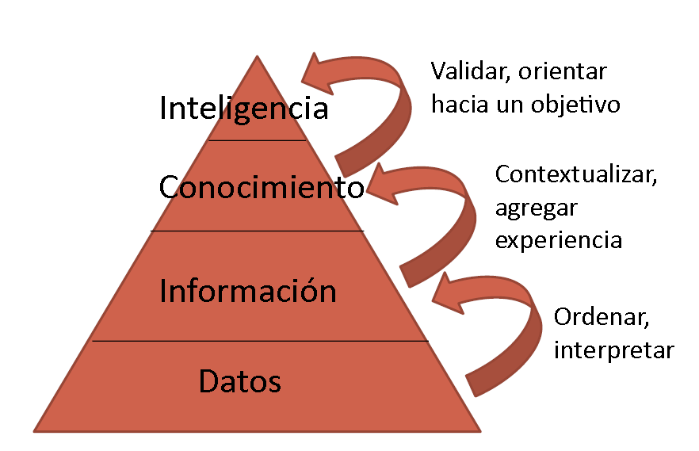

# 1. SGE - Software de Gestión Empresas

- [1. SGE - Software de Gestión Empresas](#1-sge---software-de-gestión-empresas)
  - [1.1. Sistema de Información](#11-sistema-de-información)
    - [1.1.1. ¿Qué funciones cumplen?](#111-qué-funciones-cumplen)
    - [1.1.2. ¿Cuales son los objetivos?](#112-cuales-son-los-objetivos)
    - [1.1.3. Evolucion de los sistemas de información](#113-evolucion-de-los-sistemas-de-información)
    - [1.1.4. Clasificación de los sistemas de información](#114-clasificación-de-los-sistemas-de-información)
    - [1.1.5. Componentes de un sistema de información](#115-componentes-de-un-sistema-de-información)
    - [1.1.6. Pirámide informacional](#116-pirámide-informacional)
    - [1.1.7. Etapas de desarrollo de un sistema de información](#117-etapas-de-desarrollo-de-un-sistema-de-información)
    - [1.1.8. Enfoque de desarrollo](#118-enfoque-de-desarrollo)
    - [1.1.9. Éxito y fracaso de los sistemas de información](#119-éxito-y-fracaso-de-los-sistemas-de-información)
  - [1.2. Los sistemas de información de las organizaciones](#12-los-sistemas-de-información-de-las-organizaciones)
  - [1.3. Soluciones integradas para la planificación de recursos](#13-soluciones-integradas-para-la-planificación-de-recursos)
  - [1.4. Gestión de la relaciones con los clientes](#14-gestión-de-la-relaciones-con-los-clientes)
  - [1.5. Gestión de la cadena de suministro](#15-gestión-de-la-cadena-de-suministro)
  - [1.6. Gestión de recursos humanos](#16-gestión-de-recursos-humanos)
  - [1.7. e-Commerce](#17-e-commerce)
  - [1.8. Business Intelligence](#18-business-intelligence)
    - [1.8.1. ¿Qué es Business Intelligence?](#181-qué-es-business-intelligence)
    - [1.8.2. Componentes de un Business Intelligence](#182-componentes-de-un-business-intelligence)
    - [1.8.3. Capacidades Analíticas de un Business Intelligence](#183-capacidades-analíticas-de-un-business-intelligence)
    - [1.8.4. Implementación de un Business Intelligence](#184-implementación-de-un-business-intelligence)
    - [1.8.5. Definición de los orígenes de datos](#185-definición-de-los-orígenes-de-datos)
    - [1.8.6. Extracción y organización de los datos](#186-extracción-y-organización-de-los-datos)
    - [1.8.7. Aplicación de herramientas analíticas](#187-aplicación-de-herramientas-analíticas)

## 1.1. Sistema de Información

### 1.1.1. ¿Qué funciones cumplen?

- `Dan soporte` a las operaciones de la empresa
- Proporcionan informacion mediante `tecnologias de la información`
- `Elemento estratégico` en busca de innovación y ventaja competitiva
- `Integran` personas, procesos, datos y tecnologías.
  - No solo en la organización, tambien proveedores, distribuidores y clientes
- `Comprender` los procesos operativos
- `Familiarizarse` con las herramientas para construir y gestionar sistemas de información
  - Toma de decisiones
  - Gestión del conocimiento
  - Gestión de procesos internos
  - Relaciones con los clientes
  - Cadena de suministros
  - Comercio electrónico
  - Inteligencia de negocios
- `Puente`entre la gestión y la tecnología
  - Analizar requisitos de la organización
  - Diseñar la solución
  - Integrar las herramientas mas adecuadas
- Identificar
  - Oportunidades de mejora
  - Innovación
  - Competir estratégicamente

### 1.1.2. ¿Cuales son los objetivos?

- Amenaza de nuevos participantes
  - Mejorar control de los canales de distribución y aprovisionamiento
  - Adecuar mejor los productos a las necesidades de los clientes
  - Explotar economías de escala
  - Competir en guerra de precios
- Amenaza de productos o servicios sustitutivos
  - Adaptación a las necesidades de los clientes
  - Identificar mas fácilmente las necesidades de los clientes
- Rivalidad con los competidores actuales:
  - Permiten reducir costes
  - Mejorar la imagen de marca
- Poder negociador de clientes y proveedores
  - Equilibrar el poder de negociación de los clientes y proveedores

### 1.1.3. Evolucion de los sistemas de información

- Introducción de la informática en la organización
  - Buscan simplificar y automatizar los procesos administrativos
  - Ahorro de costes y tiempo de la realización
  - Carencia de formación del personal en informática
- Etapa de contagio de las aplicaciones informáticas
  - Mejoras difundiendo por los diferentes departamentos
  - Contagio sin ninguna planificación que produce incremento de los costes
  - Aumenta la formacón del personal en informática
- Coordinación de los sistemas de información y los objetivos de la empresa
  - Se utilizan en la totalidad de la organización como elemento fundamental
  - Se elaboran los procedimientos de planificación de los sistemas de información
- Aparición de los sistemas de infromación estratégicos
  - Se convierten en ventaja competitiva
  - Se tienen en cuenta al elaborar la estrategia como otros aspetos clave de la empresa
  - El responsable de los sistemas de información se convierte en un miembro mas del comité de dirección

### 1.1.4. Clasificación de los sistemas de información

- Formalidad
  - Formales
  - Informales
- Automatización
  - Manuales
  - Automáticos
- Toma de decisiones
  - Estratégicos
  - Gerenciales
  - Operativos
- Funcionalidad
  - Gestión comercial
  - Gestión contable
  - Gestion financiera
  - Gestion de RRHH
  - Gestion de la produccion
- Especialización
  - Especificos
  - Generales

### 1.1.5. Componentes de un sistema de información

- Equipamiento
  - HW
  - SW
  - Tecnologías de almacenamiento
  - Tecnologías de comunicación
- Usuarios
  - Personal directivo
  - Empleados
  - Clientes
  - Proveedores
- Procesos
  - Compras
  - Facturación de ventas o servicios
  - Gestión de personal
  - ...
- Datos
  - Datos generales de cliente
  - Tickets de venta
  - Albaranes de compra
  - ...

### 1.1.6. Pirámide informacional

### 1.1.7. Etapas de desarrollo de un sistema de información

1. Definición del proyecto
   - Encontrar problemas y soluciones
   - Identificar objetivos y ubicarlos en la estrategia global
   - Comprender y confiar en los sistemas de información como armas estratégicas
2. Análisis de sistemas
   - Realizar estudio de factibilidad
      - Tecnico - ¿Se tienen los medios?
      - Económico - ¿Se tiene el dinero?
      - Operativo - ¿Es posible con la organización y personal actual?
3. Diseño de Sistemas
   - Detallar los requisitos planteados en la fase de análisis
   - Indicar componentes tanto HW como SW y su relacion
   - Realizar las especificaciones técnicas del sistema
4. Programacón
   - Traducir las especificaciones técnicas en un lenguaje de programación
5. Fase de pruebas
   - Proceso exhaustivo y profundo en diversas condiciones para comprobar que los resultados son correctos.
     - Pruebas de programas - Comprobar que el programa funciona correctamente
     - Pruebas de sistemas - Comprobar que el sistema en conjunto funciona correctamente
     - Pruebas de aceptación - Comprobar que los usuarios finales estan satisfechos
6. Migración
   - Si ya existia un sistema se debe migrar la información
     - Estrategia en paralelo - Se ejecutan los dos sistemas a la vez durante un periodo de tiempo
     - Camio directo - Se cambia de un sistema a otro de forma directa
     - Experiencia piloto - Se prueba el sistema en un departamento y si funciona se extiende a toda la organización
7. Producción y mantenimiento
   - Proceso constante de evaluación y mejora medainte la corrección de errores y la adaptación a las necesidades de la organización

### 1.1.8. Enfoque de desarrollo

- Ciclo de vida clásico en cascada
- Prototipos
- Metodologías ágiles
  - Scrum
  - Kanban
  - XP

### 1.1.9. Éxito y fracaso de los sistemas de información

- Falta de alineación entre los sistemas de información y la estrategia de la empresa
  - Considerar los sistemas de información como una simple herramienta y no valorar su importancia estratégica
- Escaso apoyo de la administracion:
  - No se percibe como arma estratégica
  - Predisposicion a cambiar la organización empresarial
- Mala identificación de las necesidades de información
- Escassa involucración o influencia del usuario final
  - Es necesaria la colaboración del usuario final
- Nula formación del personal

## 1.2. Los sistemas de información de las organizaciones

## 1.3. Soluciones integradas para la planificación de recursos

## 1.4. Gestión de la relaciones con los clientes

## 1.5. Gestión de la cadena de suministro

## 1.6. Gestión de recursos humanos

## 1.7. e-Commerce

## 1.8. Business Intelligence

### 1.8.1. ¿Qué es Business Intelligence?

- Herramientas y sistemas que permiten recopilar, almacenar, procesar, acceder y analizar información para la generación de informes casi en tiempo real para la toma de decisiones
  - IBM Cognos
  - Oracle BI
  - Microsoft BI
  - Hitachi Vantara
  - tableau
  - QlikView
  - Business Objects

### 1.8.2. Componentes de un Business Intelligence

- Datos de entorno empresarial
  - SQL o NoSQL
  - Big Data
- Infraestructura de BI
  - SGBD potentes
  - Almacenan TODOS los datos de la empresa
- Business Analytics Toolset
  - Software de análisis de datos
- Usuarios y métodos de dirección
  - Metodologías de análisis
- Distribución de información
  - Presentar a cada usuario la información que necesita
- Interfaz de usuario
  - Imagenes, graficos, tablas, etc
  - Visual

### 1.8.3. Capacidades Analíticas de un Business Intelligence

- Capacidad apra generar:
  - Informes fijos
  - Informes parametrizados
  - Cuadros de mando
  - Creación de informes ad-hoc
  - Capacidad de desglose para más detalles

### 1.8.4. Implementación de un Business Intelligence

- Requisitos
  - Definir los orígenes de datos
  - Extracción y organización de los datos
  - Aplicación de herramientas analíticas
  - Visualización de los resultados
- Pasos
  - Entender las necesidades de la empresa
  - Minar los datos
  - Limpiar los datos
  - Analizar los datos
  - Seleccionar los datos relevantes
  - Crear un modelo predictivo
  - Visualizar los datos

### 1.8.5. Definición de los orígenes de datos

- CRM
  - Relaciones con los clientes
- RRHH
  - Recursos humanos
- ERP
  - Planificación de recursos
- Suply Chain
  - Cadena de suministros
- Otros
  - Bases de datos
  - Documentos impresos
  - Archivos de texto
  - Archivos multimedia
  - Sistemas operativos

### 1.8.6. Extracción y organización de los datos

- Proceso:
  - Tratar inconsistencia en el formato o codificación de los datos
  - Filtrado y reestrucuración de los datos
  - Tratar las inconsistencias en el contenido
  - Crear rutinas para automatizar la transformaciónes ya definidas de los datos
- Asegurar la calidad de los datos
- Eliminar datos incorrectos, desactualizados o incosistentes, llevan a errores.
- Auditar la calidad de los datos
  - Analizar la corrección de completitud de los datos
  - Se realiza sobre todos los datos, muestras de datos o sobre encuestas a los usuarios.
- Limpieza de datos
  - Detectar y corregir los datos incorrectos
  - No solo corrige si no que evita inconsistencias futuras

### 1.8.7. Aplicación de herramientas analíticas

- Se han generado BBDD para grandes volúmenes de datos
- Pueden ser tanto SQL como NoSQL
- Se pueden ofrecer como servicio web
- Una vez capturado los datos se generan informes
  - OLAP
    - Datos multidimensionales
    - Se presentan con formato de cubo
    - Se calculan todas las posibles combinaciones de los datos para obtener la información de la forma mas rápida y precisa
    - Rotar el cubo muestra las diferentes perspectivas
    - Tiene soporte para consultas complejas
    - Se necesita tener una idea sobre la información que se quiere obtener
  - Data mining
    - Orientada al descubrimiento
    - Busca patrones y relaciones en los datos para inferir reglas con las que predecir comportamientos futuros
    - Estas reglas se usan para la toma de decisiones
    - Tipos de información
      - Asociaciones
      - Secuencias
      - Clasificación
      - Clustering
      - Pronósticos
  - Querying and reporting
    - Informes formateados para los diferentes niveles de la organización
    - Los informes operativos muestran la realidad de la empresa inmediata
    - Los informes analíticos muestran la información de forma mas detallada
      - Resumen de la información
      - Fines analíticos
      - Tomar decisiones
